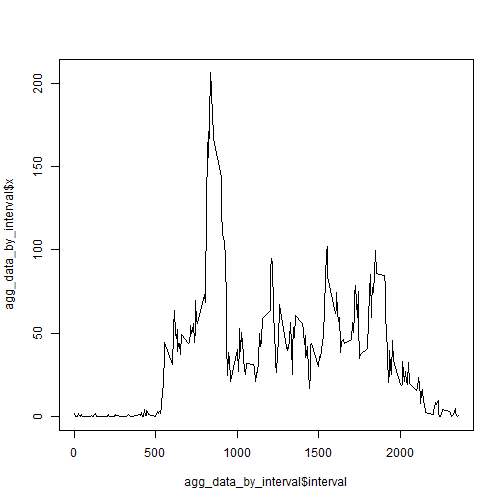
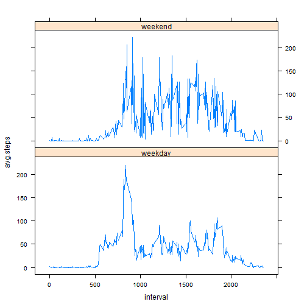

# Reproducible Research: Peer Assessment 1


## Loading and preprocessing the data

```r
## Unzip and reading of data
unzip("activity.zip", exdir = "tempdir")
data <- read.csv("tempdir/activity.csv")
## Data Frame without NAs
data_wo_nas <- data[complete.cases(data[, 1]), ]
```


## What is the mean of the total number of steps taken per day?
### Histogram:

```r
## Aggregation of data
agg_data <- aggregate(data_wo_nas$steps, by = list(date = data_wo_nas$date), 
    FUN = sum)
## Barplot
barplot(agg_data$x, names = agg_data$date)
```

 

```r
## Mean and median
mean_steps_by_day <- mean(agg_data$x)
median_steps_by_day <- median(agg_data$x)
```

The mean of the total number of steps taken per day is 1.0766 &times; 10<sup>4</sup>.

The median of the total number of steps taken por day is 10765.

## What is the average daily activity pattern?

```r
## Aggregation by interval
agg_data_by_interval <- aggregate(data_wo_nas$steps, by = list(interval = data_wo_nas$interval), 
    FUN = mean)
## Plot
plot(agg_data_by_interval$interval, agg_data_by_interval$x, type = "l")
```

 

```r
## Interval with máximun number of steps
interval_max_steps <- agg_data_by_interval$interval[agg_data_by_interval$x == 
    max(agg_data_by_interval$x)]
```

The 5-minute interval which contains on average the maximum number of steps across all the days
is 835.


## Imputing missing values

```r
# Get number of missing values
missing_values <- nrow(data[is.na(data$steps), ])
# New data frame substituing missing values
fix_data <- data
agg <- agg_data_by_interval
fill <- function(interval, agg) agg[agg$interval == interval, 2]
fix_data[is.na(fix_data$steps), 1] <- sapply(fix_data[is.na(fix_data$steps), 
    3], FUN = fill, agg = agg)
# Histogram of total number of steps taken each day
agg_fix_data <- aggregate(fix_data$steps, by = list(date = fix_data$date), FUN = sum)
barplot(agg_fix_data$x, names = agg_fix_data$date)
```

 

```r

# Mean and median of total number of steps taken each day
fix_mean_steps_by_day <- mean(agg_fix_data$x)
fix_median_steps_by_day <- median(agg_fix_data$x)
```

The total number of missing values is 2304.

For filling the missing values, we will use the mean of the 5-minute interval in which they were
found.
Whith these filled values we get the following data:
* Mean of the total number of steps taken per day: 1.0766 &times; 10<sup>4</sup>.
* Median of the total number of steps taken por day: 1.0766 &times; 10<sup>4</sup>.


## Are there differences in activity patterns between weekdays and weekends?

```r
## Factor by weekday
fix_data$weekday <- weekdays(as.Date(fix_data$date))
fix_data[fix_data$weekday == c("sábado", "domingo"), "weekday"] <- "weekend"
fix_data[fix_data$weekday != c("weekend"), "weekday"] <- "weekday"
fix_data$weekday <- as.factor(fix_data$weekday)
## Aggregation
agg_fix_data_by_interval_wk <- aggregate(fix_data$steps, by = list(interval = fix_data$interval, 
    weekday = fix_data$weekday), FUN = mean)
agg_fix_data_by_interval_wk <- aggregate(fix_data$steps ~ interval + weekday, 
    fix_data, FUN = mean)
colnames(agg_fix_data_by_interval_wk) <- c("interval", "weekday", "avg.steps")
## Plot
library(lattice)
```

```
## Warning: package 'lattice' was built under R version 3.0.3
```

```r
xyplot(avg.steps ~ interval | weekday, agg_fix_data_by_interval_wk, type = "l", 
    layout = c(1, 2))
```

 


